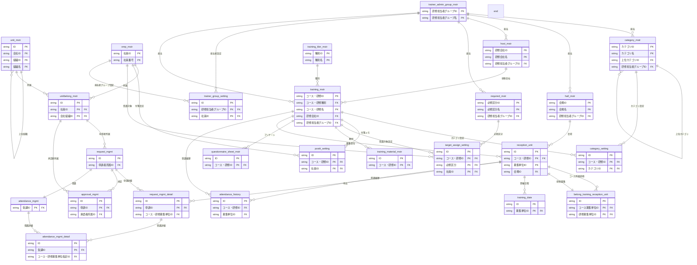

```mermaid
erDiagram
    %% マスタテーブル
    unit_mstr ||--o{ unit_mstr : "上位組織"
    unit_mstr ||--o{ unitbelong_mstr : "所属"
    emp_mstr ||--o{ unitbelong_mstr : "所属"
    emp_mstr ||--o{ postit_setting : "付箋設定"
    emp_mstr ||--o{ target_assign_setting : "受講対象"
    emp_mstr ||--o{ trainer_group_setting : "担当者グループ設定"

    %% カテゴリ関連
    category_mstr ||--o{ category_mstr : "上位カテゴリ"
    category_mstr ||--o{ category_setting : "カテゴリ設定"
    
    %% 研修担当者グループ関連
    trainer_admin_group_mstr ||--o{ category_mstr : "担当"
    trainer_admin_group_mstr ||--o{ hall_mstr : "担当"
    trainer_admin_group_mstr ||--o{ host_mstr : "担当"
    trainer_admin_group_mstr ||--o{ required_mstr : "担当"
    trainer_admin_group_mstr ||--o{ trainer_group_setting : "担当者設定"
    trainer_admin_group_mstr ||--o{ training_mstr : "担当"

    %% 研修関連
    training_kbn_mstr ||--o{ training_mstr : "種別"
    host_mstr ||--o{ training_mstr : "研修会社"
    training_mstr ||--o{ category_setting : "カテゴリ設定"
    training_mstr ||--o{ postit_setting : "付箋メモ"
    training_mstr ||--o{ target_assign_setting : "受講対象設定"
    training_mstr ||--o{ training_material_mstr : "教材"
    training_mstr ||--o{ questionnaire_sheet_mstr : "アンケート"
    training_mstr ||--o{ reception_unit : "募集単位"
    training_mstr ||--o{ attendance_history : "受講履歴"

    %% 会場関連
    hall_mstr ||--o{ reception_unit : "会場"

    %% 募集単位関連
    reception_unit ||--o{ belong_training_reception_unit : "コース所属研修"
    reception_unit ||--|| belong_training_reception_unit : "研修募集"
    reception_unit ||--o{ training_date : "開催日程"
    reception_unit ||--o{ request_mgmt_detail : "申込"
    reception_unit ||--o{ attendance_history : "受講履歴"

    %% 申請・承認・受講関連
    unitbelong_mstr ||--o{ request_mgmt : "申請者所属"
    unitbelong_mstr ||--o{ approval_mgmt : "承認者所属"
    
    request_mgmt ||--o{ request_mgmt_detail : "申請詳細"
    request_mgmt ||--o{ approval_mgmt : "承認"
    request_mgmt ||--|| attendance_mgmt : "受講"
    
    request_mgmt_detail ||--o{ attendance_mgmt_detail : "受講詳細"
    attendance_mgmt ||--o{ attendance_mgmt_detail : "受講詳細"

    %% 必修区分関連
    required_mstr ||--o{ target_assign_setting : "必修区分"
    
    %% エンティティ定義
    unit_mstr {
        string ID PK
        string 会社ID PK
        string 組織ID PK
        string 組織名 PK
    }
    
    emp_mstr {
        string 社員ID PK
        string 社員番号 PK
    }
    
    unitbelong_mstr {
        string ID PK
        string 社員ID PK "FK"
        string 会社組織ID PK "FK"
    }
    
    category_mstr {
        string カテゴリID PK
        string カテゴリ名 PK
        string 上位カテゴリID FK
        string 研修担当者グループID FK
    }
    
    hall_mstr {
        string 会場ID PK
        string 会場名 PK
        string 研修担当者グループID FK
    }
    
    host_mstr {
        string 研修会社ID PK
        string 研修会社名 PK
        string 研修担当者グループID FK
    }
    
    training_kbn_mstr {
        string 種別ID PK
        string 種別名 PK
    }
    
    required_mstr {
        string 必修区分ID PK
        string 必修区分名 PK
        string 研修担当者グループID FK
    }
    
    trainer_admin_group_mstr {
        string 研修担当者グループID PK
        string 研修担当者グループ名 PK
    }
    
    category_setting {
        string ID PK
        string コース・研修ID PK "FK"
        string カテゴリID PK "FK"
    }
    
    postit_setting {
        string ID PK
        string コース・研修ID PK "FK"
        string 社員ID PK "FK"
    }
    
    target_assign_setting {
        string ID PK
        string コース・研修ID PK "FK"
        string 必修区分 PK "FK"
        string 社員ID PK "FK"
    }
    
    trainer_group_setting {
        string ID PK
        string 研修担当者グループID PK "FK"
        string 社員ID PK "FK"
    }
    
    training_mstr {
        string コース・研修ID PK
        string コース・研修種別 FK
        string コース・研修名 PK
        string 研修会社ID FK
        string 研修担当者グループID FK
    }
    
    training_material_mstr {
        string ID PK
        string コース・研修ID PK "FK"
    }
    
    questionnaire_sheet_mstr {
        string ID PK
        string コース・研修ID PK "FK"
    }
    
    reception_unit {
        string ID PK
        string コース・研修ID PK "FK"
        string 募集単位ID PK
        string 会場ID FK
    }
    
    belong_training_reception_unit {
        string ID PK
        string コース募集単位ID PK "FK"
        string 研修募集単位ID PK "FK"
    }
    
    training_date {
        string ID PK
        string 募集単位ID PK "FK"
    }
    
    request_mgmt {
        string ID PK
        string 申請者所属ID FK
    }
    
    request_mgmt_detail {
        string ID PK
        string 申請ID PK "FK"
        string コース・研修募集単位ID FK
    }
    
    approval_mgmt {
        string ID PK
        string 申請ID PK "FK"
        string 承認者所属ID FK
    }
    
    attendance_mgmt {
        string 受講ID PK "FK"
    }
    
    attendance_mgmt_detail {
        string ID PK
        string 受講ID PK "FK"
        string コース・研修募集単位指定ID FK
    }
    
    attendance_history {
        string ID PK
        string コース・研修ID FK
        string 募集単位ID FK
    }    
    
    end
```