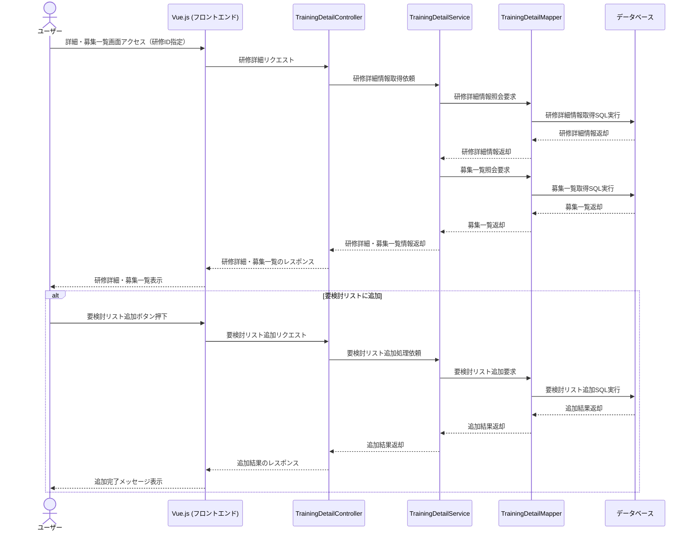

```mermaid
sequenceDiagram
    actor ユーザー
    participant フロントエンド as Vue.js (フロントエンド)
    participant コントローラー as TrainingDetailController
    participant サービス as TrainingDetailService
    participant マッパー as TrainingDetailMapper
    participant DB as データベース
    
    ユーザー->>フロントエンド: 詳細・募集一覧画面アクセス（研修ID指定）
    フロントエンド->>コントローラー: 研修詳細リクエスト
    コントローラー->>サービス: 研修詳細情報取得依頼
    サービス->>マッパー: 研修詳細情報照会要求
    マッパー->>DB: 研修詳細情報取得SQL実行
    DB-->>マッパー: 研修詳細情報返却
    マッパー-->>サービス: 研修詳細情報返却
    
    サービス->>マッパー: 募集一覧照会要求
    マッパー->>DB: 募集一覧取得SQL実行
    DB-->>マッパー: 募集一覧返却
    マッパー-->>サービス: 募集一覧返却
    
    サービス-->>コントローラー: 研修詳細・募集一覧情報返却
    コントローラー-->>フロントエンド: 研修詳細・募集一覧のレスポンス
    フロントエンド-->>ユーザー: 研修詳細・募集一覧表示
    
    alt 要検討リストに追加
        ユーザー->>フロントエンド: 要検討リスト追加ボタン押下
        フロントエンド->>コントローラー: 要検討リスト追加リクエスト
        コントローラー->>サービス: 要検討リスト追加処理依頼
        サービス->>マッパー: 要検討リスト追加要求
        マッパー->>DB: 要検討リスト追加SQL実行
        DB-->>マッパー: 追加結果返却
        マッパー-->>サービス: 追加結果返却
        サービス-->>コントローラー: 追加結果返却
        コントローラー-->>フロントエンド: 追加結果のレスポンス
        フロントエンド-->>ユーザー: 追加完了メッセージ表示
    end
```